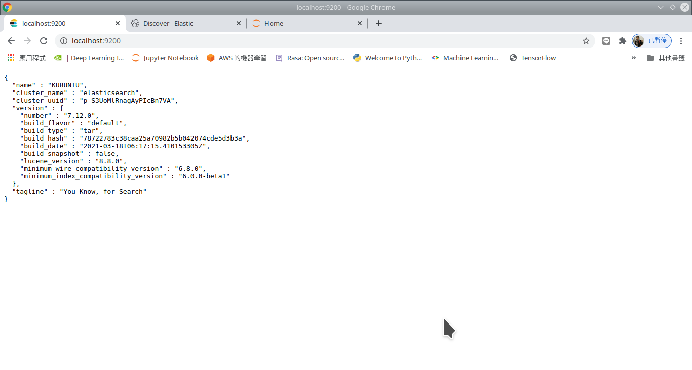
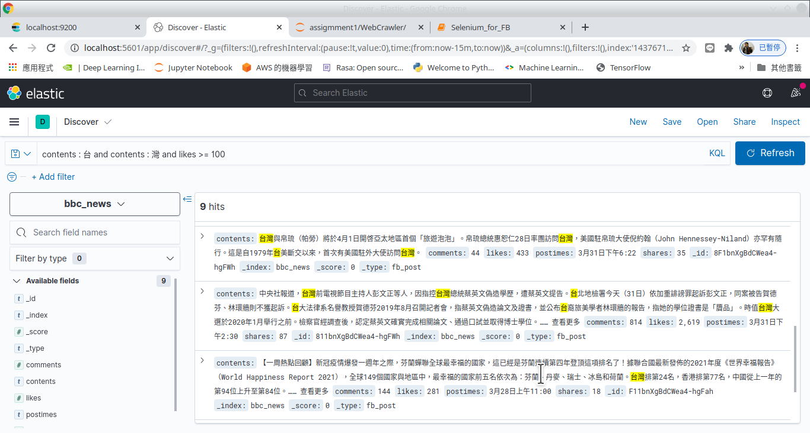
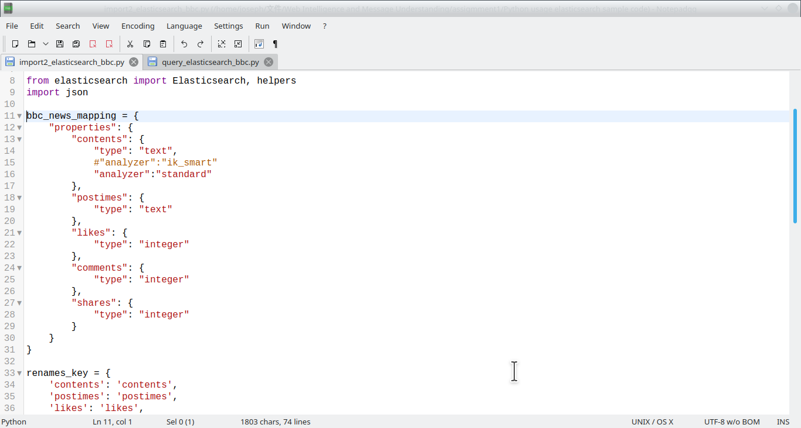

### Web Crawler and Elasticsearch IR system

Crawl the BBC News Facebook fans page and import to Elasticsearch IR system and Elastic Kibana

#### Web Crawler with Selenium and Beautiful Soup

1. Automatic login to facebook.
2. Set url = 'https://www.facebook.com/bbcnewstrad'
3. Scoll down the fans page automatically
4. Get the all numbers of likes
5. Get all the numbers of comments and shares
6. Get all the contents and time of posts

#### Run elasticsearch and kibana

1. run elasticsearch
```
./bin/elasticsearch
```

2. run kibana
```
./bin/kibana
```

#### DB Schema



#### Query examples:

* contents : "台灣" and comments >= 100
* contents : "愚人節" and postimes : "4月1日"
* contents : "愚人節" and postimes : "4月1日" and shares >= 100
* postimes : "4月1日" and contents : * 
* postimes : "4月1日" and comments <= 100
* postimes : "4月1日" or contents : "疫苗"
* postimes : "4月1日" or postimes : "昨天"
